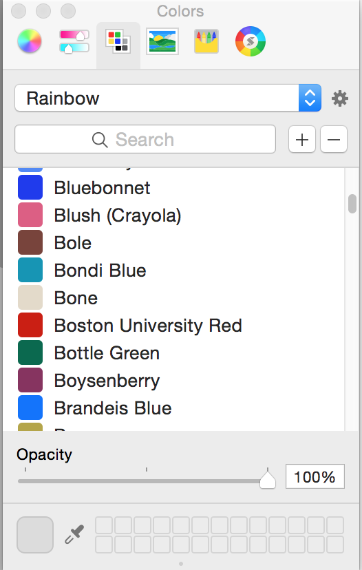
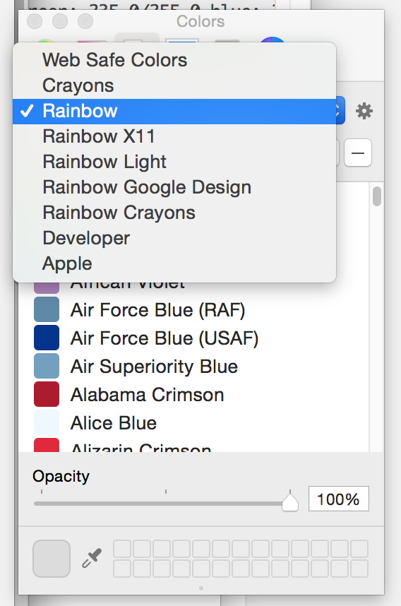

# Rainbow-Palettes

Now you can have the [Rainbow Library](https://github.com/NorthernRealities/Rainbow) of colours in your picker.  All of the palette names start with Rainbow.  You get an impressive list of colours available to you.

Here's an image of all of the palettes installed.

Thanks to Gyetván András for giving me the idea of putting the palettes into the picker.  Also to Duncan Grant for his [tutorial](http://www.midwinter-dg.com/permalink-how-I-created-a-set-of-pantone-swatches-for-the-mac-osx-color-picker_2014-08-09.html) which helped me out.

# Installation

It's as easy as downloading everything as a zip file and moving the .clr files into your personal Colors folder which is located in your Library folder.

